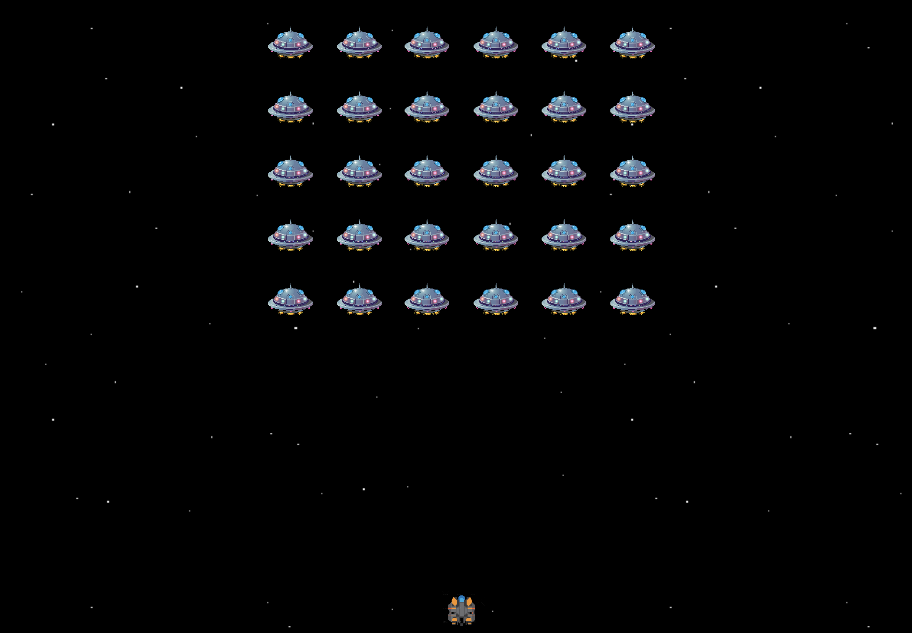

# Space(bar) Shooter

## Description
Space(bar) Shooter recreates the classic arcade game Space Invaders by using DOM, OOP, HTML, CSS and vanilla JavaScrpit.

## Instructions
Move player by using left/right arrow keys and, as the name implies, spacebar to shoot.

You Win: destroy all enemies spaceships to win this game.

Game Over: if an enemy's spaceship reaches the bottom of the screen you lose.

## Play
https://mauro404.github.io/game/

